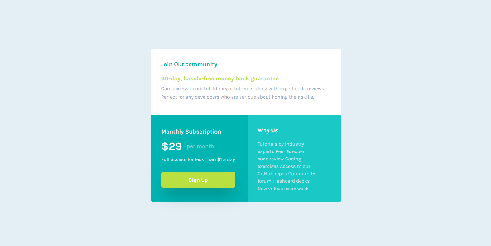

# Frontend Mentor - Single price grid component solution

This is a solution to the [Single price grid component challenge on Frontend Mentor](https://www.frontendmentor.io/challenges/single-price-grid-component-5ce41129d0ff452fec5abbbc). Frontend Mentor challenges help you improve your coding skills by building realistic projects. 

## Table of contents

- [Overview](#overview)
  - [The challenge](#the-challenge)
  - [Screenshot](#screenshot)
  - [Links](#links)
- [My process](#my-process)
  - [Built with](#built-with)
  - [What I learned](#what-i-learned)
  - [Continued development](#continued-development)
  - [Useful resources](#useful-resources)
- [Author](#author)


## Overview

### The challenge

Users should be able to:

- View the optimal layout for the component depending on their device's screen size
- See a hover state on desktop for the Sign Up call-to-action

### Screenshot




### Links

- Solution URL: [Solution](https://www.frontendmentor.io/solutions/responsive-single-price-grid-component-qS_kPJlkm0)
- Live Site URL: [Live Site](https://devjhex-single-price-grid-component.vercel.app)

## My process

### Built with

- Semantic HTML5 markup
- CSS custom properties
- Flexbox
- CSS Grid
- Mobile-first workflow


### What I learned
I learnt something new from a youtube short that i watched recently that was about the button element. The button element comes with so many properties by default that have to be reset for example padding, font etc. But there is something that I found very helpful and that is the all property with the value of unset.
```css
  button {
    all:unset;
  }
``` 
This is kind of like a shorthand of inherit of all properties of an element so instead of typing all the properties resetting them, this one-line of CSS would do so much better. I thought this is cool.


### Continued development
I want to continue to make sure I get used to all sorts new properties that make life easier in CSS hence also sharing them with others.


### Useful resources

- [MDN](https://developer.mozilla.org) - I would not stop recommending this site because it is great for research most especially how to use certain properties not only in CSS but also JavaScript.

## Author
- Frontend Mentor - [@Dev-Jhex](https://www.frontendmentor.io/profile/Dev-Jhex)
- Twitter - [@devJhex](https://www.twitter.com/devJhex)

